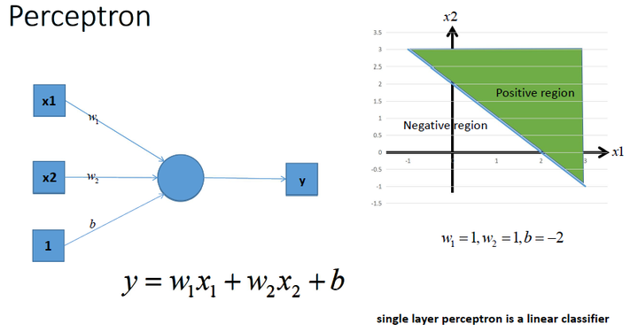
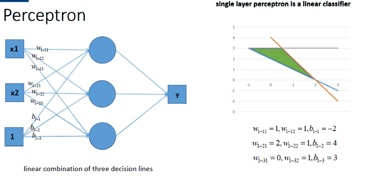
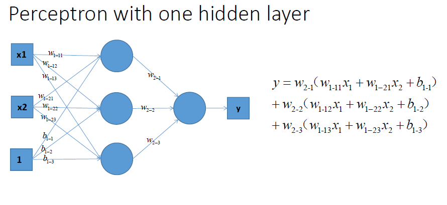

# 激活函数们

## 引入非线性因素

在我们面对线性可分的数据集的时候，简单的用线性分类器即可解决分类问题。但是现实生活中的数据往往不是线性可分的，面对这样的数据，一般有两个方法：引入非线性函数、线性变换。

### 线性变换

将非线性的数据精美过某种变换使之被映射到线性空间，使得数据变得线性可分。

### 激活函数

激活函数通过输入线性输出非线性达到引入非线性因素的效果。接下来我么对激活函数进行一个简单的讨论，并在后面附上一些常见的激活函数。

## 激活函数的作用

因为线性模型的表达能力不够，引入激活函数是为了添加非线性因素。

在没有激活函数的神经网络中，每一层输出的都是上一层输入的线性函数，所以无论网络结构怎么搭，输出都是输入的**线性组合**。

上图中是一个单层感知机。单层感知机能够将空间用直线划分为两个区域，从而获得一种类似二分类的能力。

我们可以通过多个感知机的组合，获得更强的分类能力：

当多个感知机组合时，会在空间内画出多根直线，将空间分成很多份，或是在空间内独立出一个封闭的有限图形。这使得感知机获得了更强的分类能力。

我们来看一下上如的感知机进行组合输出的结果：

可以看出，不论怎么组合，都是输出都是输入的线性变换，无法做到能够用在空间内画出曲线或是更复杂操作的非线性分类。
